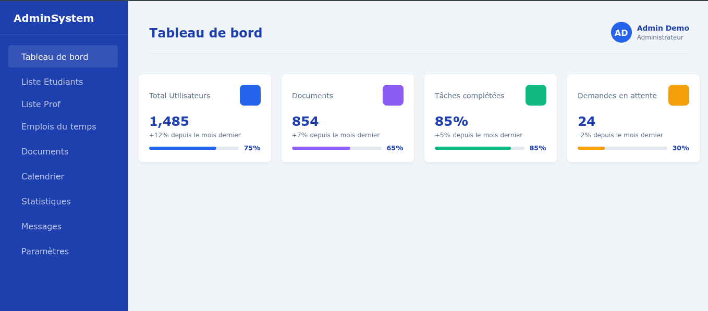

# 🎓 Projet de Gestion Universitaire (Django)

Ce projet est une application web développée avec Django, destinée à la gestion des étudiants, des inscriptions et des filières dans un établissement universitaire.

---

## 🚀 Fonctionnalités Actueles

- Authentification des utilisateurs (login/logout)
- Dashboard personnalisé pour les étudiants
- Formulaire d'inscription d'étudiant
- Liste des étudiants inscrits
- Attribution à une filière

---

## 🧰 Technologies utilisées

- Python 3.10+
- Django 4+
- HTML/CSS classique (sans Tailwind)
- SQLite (par défaut)
- Bootstrap (optionnel)
- Pillow (pour les images de profil)

## ⚙️ Installation locale

1. **Cloner le projet :**

```bash
git clone https://github.com/ton-utilisateur/gestion_universitaire.git
cd gestion_universitaire
Créer et activer un environnement virtuel :

2. **Installer les dépendances : :**
python3 -m venv env
source env/bin/activate

3. **Installer les dépendances : :**
pip install -r requirements.txt

4. **Appliquer les migrations :: :**
python manage.py migrate


5. **Créer un superutilisateur (admin) :**
python manage.py createsuperuser (user: admin/ mdp: admin)


6. **Lancer le serveur de développement :**
python manage.py runserver
Accéder à l'application sur http://127.0.0.1:8000


---

## 🖥️ Aperçu de l'application

### 🔐 Page de connexion


### 📊 Tableau de bord étudiant



### 🧑‍🎓 Liste des étudiants


---

👤 Auteur
Nom : Sitrakaniaina RAKOTOMALALA
Contact : ainasaint@gmail.com