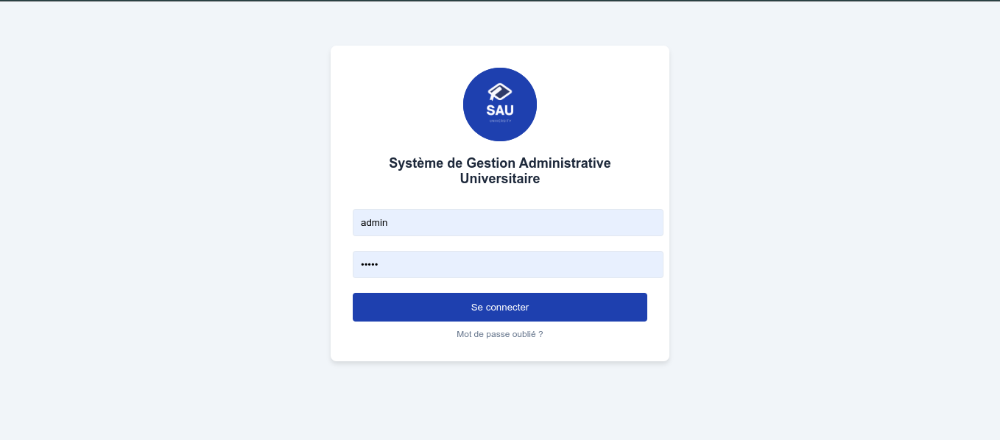

## ğŸ–¥ï¸ Aperçu de l'application

### 🔠Page de connexion



### 📊 Tableau de bord étudiant


### 🧑â€ğŸ“ Liste des étudiants


Si tu veux, je peux aussi t’écrire un README.md complet avec :

Installation du projet

Lancement en local

Technologies utilisées

Pré-requis

Et cet aperçu

Souhaites-tu cela aussi ?


Vous avez dit :
oui


ChatGPT a dit :
Voici un README.md complet pour ton projet Django gestion_universitaire, prêt à être copié-collé dans ton dépôt GitHub. Assure-toi d’avoir les 3 images (login.png, dashboard.png, liste_etudiants.png) à la racine du projet (au même niveau que ce fichier README.md).

markdown
Copier
Modifier
# 📠Gestion Universitaire

Une application web développée avec Django permettant de gérer les étudiants, leurs inscriptions et leurs filières. L’application comprend une authentification sécurisée, un tableau de bord pour les étudiants, et une interface d'administration pour les membres du personnel.

---

## 🚀 Installation du projet

### âš™ï¸ Prérequis

- Python 3.10+
- pip
- virtualenv (recommandé)
- Git
- Pillow (pour la gestion des images)

### 📥 Cloner le dépôt

```bash
git clone https://github.com/ainaBug/gestion_universitaire.git
cd gestion_universitaire

🧪 Créer un environnement virtuel
python3 -m venv env
source env/bin/activate  # Linux/macOS
env\Scripts\activate     # Windows

📦 Installer les dépendances
pip install -r requirements.txt
# Ou si requirements.txt n'existe pas encore :
pip install django pillow

ğŸ› ï¸ Appliquer les migrations
python manage.py makemigrations
python manage.py migrate

👤 Créer un superutilisateur
python manage.py createsuperuser

â–¶ï¸ Lancer le serveur
python manage.py runserver
Ensuite, accédez à http://127.0.0.1:8000 dans votre navigateur.

ğŸ–¥ï¸ Aperçu de l'application
🔠Page de connexion

📊 Tableau de bord étudiant

🧑â€ğŸ“ Liste des étudiants

🧰 Technologies utilisées
Python

Django

HTML/CSS (templates)

SQLite (base de données par défaut)

Pillow (gestion des fichiers image)

📠Arborescence simplifiée
arduino
Copier
Modifier
gestion_universitaire/
│
├── etudiants/
│   ├── models.py
│   ├── views.py
│   ├── forms.py
│   └── templates/
│       └── etudiants/
│           ├── dashboard.html
│           └── ...
│
├── formations/
│   ├── models.py
│   └── ...
│
├── templates/
│   └── auth/
│       └── login.html
│
├── config/
│   ├── settings.py
│   └── urls.py
│
├── login.png
├── dashboard.png
├── liste_etudiants.png
└── README.md

📌 Remarques
Le projet est en cours de développement et peut être enrichi avec la gestion des notes, des emplois du temps ou des paiements.

🧑â€ğŸ’» Auteur
ainaBug